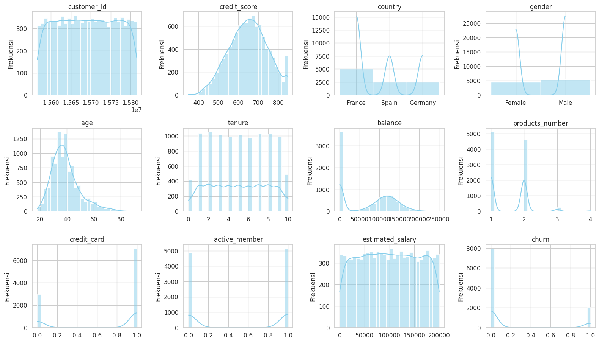
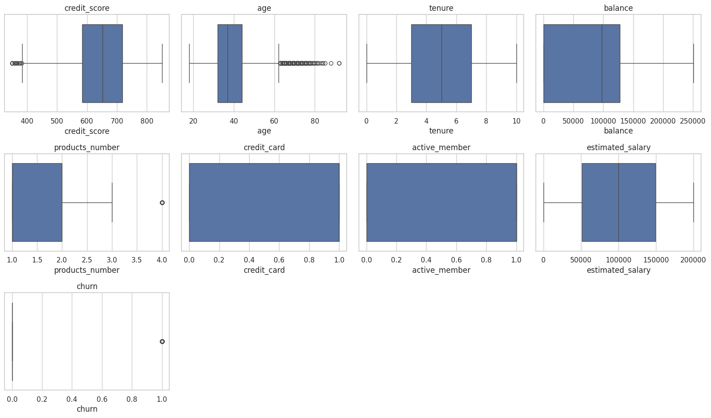
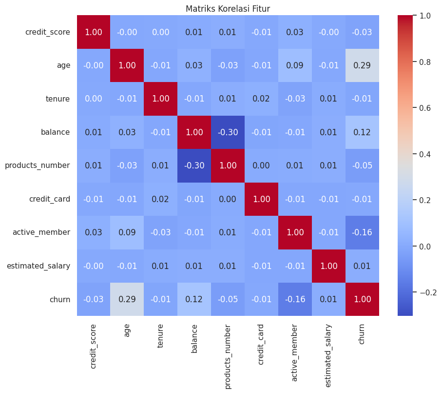
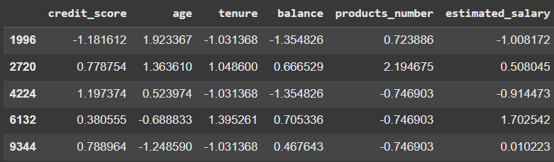
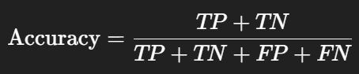
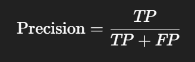
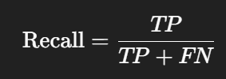
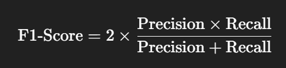

# Laporan Proyek Machine Learning - Satyavira Prathama

## Domain Proyek

Customer churn atau hilangnya pelanggan merupakan salah satu tantangan utama dalam industri perbankan modern. Ketika pelanggan memutuskan untuk berhenti menggunakan layanan sebuah bank, hal ini tidak hanya berdampak pada pendapatan, tetapi juga mencerminkan potensi masalah dalam kepuasan, loyalitas, atau kualitas layanan yang diberikan. Studi menunjukkan bahwa biaya untuk mendapatkan pelanggan baru jauh lebih tinggi dibandingkan mempertahankan pelanggan yang sudah ada, sehingga deteksi dini terhadap kemungkinan churn menjadi sangat krusial dalam strategi bisnis bank.

Dalam praktiknya, identifikasi pelanggan yang berisiko churn sering dilakukan secara manual atau berdasarkan asumsi bisnis, yang cenderung kurang akurat dan tidak skalabel. Seiring dengan meningkatnya digitalisasi dan ketersediaan data transaksi pelanggan, pendekatan berbasis machine learning menjadi solusi yang sangat potensial. Dengan kemampuannya dalam mengenali pola tersembunyi dari data historis pelanggan seperti lama menjadi nasabah, jumlah produk yang digunakan, aktivitas transaksi, serta status keanggotaan aktif, machine learning dapat membantu memprediksi secara otomatis pelanggan yang kemungkinan akan berhenti menggunakan layanan.

Dari studi yang didapatkan terdapat dua algoritma yang digunakan yaitu logistic regression dan random forest yang telah terbukti efektif dalam mengklasifikasikan risiko churn dengan akurasi yang tinggi (Mutanen et al., 2010; Gospel, 2024). 

Dalam proyek ini, akan digunakan dataset “Bank Customer Churn Dataset” dari Kaggle, yang mencakup fitur-fitur demografis dan perilaku pelanggan. Tujuan dari proyek ini adalah mengembangkan model prediksi churn berbasis machine learning yang tidak hanya akurat, tetapi juga dapat dijadikan alat bantu bagi bank dalam merancang strategi retensi pelanggan secara lebih tepat dan efisien.

Mutanen, T., Nousiainen, S., & Ahola, J. (2010). Customer churn prediction - A case study in retail banking. In C. Soares, & R. Ghani (Eds.), Data Mining for Business Applications (pp. 77-83) https://doi.org/10.3233/978-1-60750-633-1-77

Gospel, I. (2024). Predicting Bank Customer Churn: A Data Science Approach. Online at https://medium.com/%40gospelisirimah/predicting-bank-customer-churn-a-data-science-approach-6a7246959fc9, accessed 15 Mei 2025.

## Business Understanding

### Problem Statements

- Bagaimana mengidentifikasi pelanggan bank yang berisiko melakukan churn secara lebih akurat dibandingkan pendekatan manual atau berbasis intuisi bisnis?
- Algoritma machine learning mana yang lebih efektif dalam memprediksi churn pelanggan berdasarkan data demografis dan perilaku, antara logistic regression dan random forest?

### Goals

- Mengembangkan sistem berbasis machine learning yang mampu mengidentifikasi pelanggan berisiko churn dengan akurasi tinggi menggunakan data historis dan perilaku pelanggan.
- Membandingkan performa algoritma machine learning untuk menemukan model terbaik dalam klasifikasi risiko churn.

### Solution statements

- Membangun model klasifikasi menggunakan algoritma Logistic Regression sebagai baseline model karena sifatnya yang sederhana dan interpretatif.
- Menguji alternatif algoritma seperti Random Forest yang memiliki performa tinggi pada studi klasifikasi churn.
- Mengukur performa model menggunakan metrik evaluasi seperti akurasi, precision, recall, dan f1-score untuk menentukan model terbaik.


## Data Understanding
Dataset yang digunakan dalam proyek ini adalah Bank Customer Churn Dataset, Dataset ini berisi data pelanggan yang digunakan untuk memprediksi apakah seorang pelanggan akan churn atau keluar bank. Dataset diambil dari kaggle. [Bank Customer Churn Dataset](https://www.kaggle.com/datasets/gauravtopre/bank-customer-churn-dataset).

### Variabel-variabel pada Bank Customer Churn dataset adalah sebagai berikut:
1. **customer_id**: Nilai acak yang mengidentifikasi pelanggan; tidak memengaruhi keputusan pelanggan untuk keluar dari bank.
2. **credit_score**: Skor kredit pelanggan; pelanggan dengan skor kredit lebih tinggi cenderung lebih stabil dan tidak keluar dari bank.
3. **country**: Lokasi geografis pelanggan; lokasi dapat memengaruhi perilaku dan keputusan pelanggan untuk keluar dari bank.
4. **gender**: Jenis kelamin pelanggan; menarik untuk dianalisis apakah jenis kelamin memiliki pengaruh terhadap keputusan pelanggan.
5. **age**: Umur pelanggan dalam tahun; pelanggan yang lebih tua biasanya lebih setia dan kecil kemungkinan keluar dari bank.
6. **tenure**: Jumlah tahun pelanggan telah menjadi nasabah; pelanggan lama biasanya lebih loyal dan tidak mudah keluar.
7. **balance**: Saldo rekening pelanggan; pelanggan dengan saldo tinggi cenderung tetap menjadi nasabah.
8. **products_number**: Jumlah produk yang dimiliki pelanggan di bank; pelanggan yang menggunakan lebih banyak produk cenderung bertahan.
9. **credit_card**: Menunjukkan apakah pelanggan memiliki kartu kredit; biasanya pelanggan dengan kartu kredit lebih terikat pada bank.
10. **active_member**: Menunjukkan apakah pelanggan aktif; pelanggan aktif cenderung tidak keluar dari bank.
11. **estimated_salary**: Perkiraan gaji pelanggan; pelanggan dengan gaji lebih rendah cenderung lebih berisiko untuk keluar dari bank.
12. **churn**: Target variabel, menunjukkan apakah pelanggan telah keluar dari bank (1) atau masih bertahan (0).

### Tahapan Exploratory Data Analysis (EDA)
Untuk memahami data lebih dalam, beberapa langkah eksplorasi dilakukan, di antaranya:

1. Mengecek Informasi & Statistik Deskriptif Dataset: Menggunakan `.info` dan `.describe` untuk mengetahui informasi awal dan statistik deskriptif dari dataset.
```
<class 'pandas.core.frame.DataFrame'>
RangeIndex: 10000 entries, 0 to 9999
Data columns (total 12 columns):
 #   Column            Non-Null Count  Dtype  
 0   customer_id       10000 non-null  int64  
 1   credit_score      10000 non-null  int64  
 2   country           10000 non-null  object 
 3   gender            10000 non-null  object 
 4   age               10000 non-null  int64  
 5   tenure            10000 non-null  int64  
 6   balance           10000 non-null  float64
 7   products_number   10000 non-null  int64  
 8   credit_card       10000 non-null  int64  
 9   active_member     10000 non-null  int64  
 10  estimated_salary  10000 non-null  float64
 11  churn             10000 non-null  int64  
dtypes: float64(2), int64(8), object(2)
memory usage: 937.6+ KB
```
Pada tahap ini, kita mengecek informasi dasar mengenai dataset. Dataset ini terdiri dari 10000 entri dan 11 kolom. Semua kolom tidak mengandung nilai yang hilang. Tipe data untuk mayoritas kolom adalah integer, kecuali kolom country dan gender, yang memiliki tipe data object dan kolom balance dan estimated_salary, yang memiliki tipe data float.
```
	customer_id	credit_score	age	tenure	balance	products_number	credit_card	active_member	estimated_salary	churn
count	1.000000e+04	10000.000000	10000.000000	10000.000000	10000.000000	10000.000000	10000.00000	10000.000000	10000.000000	10000.000000
mean	1.569094e+07	650.528800	38.921800	5.012800	76485.889288	1.530200	0.70550	0.515100	100090.239881	0.203700
std	7.193619e+04	96.653299	10.487806	2.892174	62397.405202	0.581654	0.45584	0.499797	57510.492818	0.402769
min	1.556570e+07	350.000000	18.000000	0.000000	0.000000	1.000000	0.00000	0.000000	11.580000	0.000000
25%	1.562853e+07	584.000000	32.000000	3.000000	0.000000	1.000000	0.00000	0.000000	51002.110000	0.000000
50%	1.569074e+07	652.000000	37.000000	5.000000	97198.540000	1.000000	1.00000	1.000000	100193.915000	0.000000
75%	1.575323e+07	718.000000	44.000000	7.000000	127644.240000	2.000000	1.00000	1.000000	149388.247500	0.000000
max	1.581569e+07	850.000000	92.000000	10.000000	250898.090000	4.000000	1.00000	1.000000	199992.480000	1.000000
```
Tabel statistik deskriptif memberikan gambaran mengenai distribusi fitur numerik dalam dataset. Beberapa informasi yang menarik dari statistik deskriptif ini adalah:

|Fitur|Penjelasan|
| --------------------- | --------------------------|
| **customer\_id**| ID unik tiap pelanggan. Nilai ini hanya digunakan untuk identifikasi, bukan untuk analisis. Nilainya mulai dari sekitar **15.56 juta** hingga **15.81 juta**.|
| **credit\_score**| Skor kredit pelanggan, berkisar antara **350 (terendah)** hingga **850 (tertinggi)**, dengan rata-rata **650.5**.
| **age**| Usia pelanggan, mulai dari **18 tahun** hingga **92 tahun**, rata-rata **38.9 tahun**. Usia ini cukup tersebar.|
| **tenure**| Lama pelanggan menjadi nasabah, dari **0 hingga 10 tahun**, dengan rata-rata **5 tahun**.|
| **balance**| Saldo nasabah, sangat bervariasi dari **0 hingga 250.898**. Terdapat **25% pelanggan memiliki saldo nol**, artinya banyak pelanggan tidak aktif secara finansial.|
| **products\_number**| Jumlah produk yang digunakan oleh pelanggan, antara **1 dan 4**, rata-rata sekitar **1.53 produk**. Sebagian besar pelanggan hanya menggunakan 1 produk.|
| **credit\_card**| Apakah pelanggan memiliki kartu kredit. Rata-rata **70.5%** pelanggan memiliki kartu kredit.|
| **active\_member**| Apakah pelanggan aktif. Sekitar **51.5%** pelanggan tergolong aktif.|
| **estimated\_salary** | Estimasi gaji pelanggan, sangat bervariasi dari **11.58** hingga **199.992**, rata-rata **100.090**. Perlu dicatat bahwa distribusi cukup lebar (std: 57.510).|
| **churn**| Target variabel. Sekitar **20.4%** pelanggan dalam dataset ini keluar dari bank. Artinya, dataset ini **sedikit tidak seimbang** terhadap kelas negatif (tidak churn). |


Beberapa fitur perlu dinormalisasi agar tidak menimbulkan bias.

2. Cek Missing Values: Mengevaluasi jumlah nilai NaN pada semua kolom yang bisa jadi merupakan data tidak tercatat.
```
	                0
customer_id	        0
credit_score        0
country	            0
gender	            0
age	                0
tenure	            0
balance	            0
products_number	    0
credit_card	        0
active_member	    0
estimated_salary	0
churn	            0
```
Hasil pengecekan missing values menunjukkan bahwa tidak ada nilai yang hilang pada dataset ini. Semua kolom memiliki 10000 entri non-null, yang berarti kita tidak perlu melakukan penanganan terhadap missing values pada tahap data preparation.

3. Pengecekan Duplicate Values: Mengevaluasi dataset apakah mengandung data duplikat yang dapat memengaruhi hasil akhir dari model.

```
Jumlah baris duplikat: 0
Baris duplikat:
Empty DataFrame
Columns: [customer_id, credit_score, country, gender, age, tenure, balance, products_number, credit_card, active_member, estimated_salary, churn]
Index: []
```
Dapat dilihat bahwa dataset yang dipakai pada proyek saat ini tidak mengandung data duplikat. Yang berarti kita tidak perlu melakukan penanganan terhadap duplicated values pada tahap data preparation.

4. Visualisasi: Histogram dan boxplot digunakan untuk mendeteksi outlier dan distribusi dari fitur-fitur numerik, serta mengecek korelasi antar fitur menggunakan heatmap.



Distribusi Setiap Fitur (Histogram + KDE)
1. customer_id
- Merata dan unik; tidak memberikan informasi prediktif karena hanya penanda identitas.

2. credit_score
- Distribusi mendekati normal dengan puncak sekitar 650-700. Sedikit ekor ke kiri (pelanggan dengan skor rendah).

3. country
- Mayoritas pelanggan berasal dari France, diikuti Germany dan Spain.

4. gender
- Distribusi hampir seimbang antara Male dan Female, sedikit lebih banyak pria.

5. age
- Distribusi condong ke kanan, mayoritas pelanggan berusia 30-40 tahun. Ada juga pelanggan lansia (>60), meskipun lebih sedikit.

6. tenure
- Distribusi merata dari 0 hingga 10 tahun. Tidak ada pola dominan.

7. balance
- Banyak pelanggan dengan saldo nol. Sisanya tersebar hingga sekitar 250.000.

8. products_number
- Mayoritas pelanggan memiliki 1 atau 2 produk bank. Sangat sedikit yang memiliki lebih dari 2 produk.

9. credit_card
- Lebih banyak pelanggan yang memiliki kartu kredit.

10. active_member
- Jumlah pelanggan aktif dan tidak aktif relatif seimbang, sedikit lebih banyak yang aktif.

11. estimated_salary
- Distribusi hampir rata, tidak ada pola khusus.

12. churn (target)
- Mayoritas pelanggan tidak churn. Ini menandakan adanya class imbalance.



Boxplot Fitur Sebelum Normalisasi
- Outlier signifikan: credit_score, age, dan products_number. Akan tetapi tetap dipertahankan dikarenakan dapat mepresentasikan data pelanggan yang valid dan signifikan.

- Fitur yang merata: tenure, estimated_salary.

- Class imbalance pada target (churn).

- Nilai biner (credit_card, active_member) tidak memberikan informasi distribusi dalam boxplot.



Matriks Korelasi
- Fitur **age** memiliki korelasi paling tinggi terhadap target `churn` (**0.29**), menunjukkan bahwa semakin tua pelanggan, semakin cenderung churn.
- **active_member** dan **balance** juga memiliki korelasi sedang terhadap `churn` menunjukkan bahwa anggota aktif cenderung tidak churn dan saldo lebih tinggi sedikit lebih cenderung churn.
- Sebagian besar fitur lainnya menunjukkan korelasi rendah satu sama lain, mengindikasikan rendahnya multikolinearitas.


## Data Preparation

Tahap ini bertujuan untuk menyiapkan data sebelum digunakan dalam proses pelatihan model machine learning. Berdasarkan hasil eksplorasi awal (EDA) di tahap Data Understanding, terdapat beberapa hal yang perlu diperhatikan dalam proses ini, seperti imbalance class pada target (churn), distribusi fitur yang tidak seragam, dan perbedaan skala antar fitur pada tahap Data Understanding. Oleh karena itu tahap ini akan dilanjutkan dengan proses downsampling, encoding, splitting data, normalisasi.

### Downsampling
Downsampling adalah menangani ketidakseimbangan kelas dalam data. Pada proyek ini downsampling digunakan dikarenakan terdapat ketidakseimbangan kelas churn pada dataset yaitu sekitar **20.4%** pelanggan dalam dataset ini keluar dari bank. Alasan perlu dibuat agar seimbang adalah agar model tidak berfokus hanya kepada kelas mayoritas.
```python
majority = df[df['churn'] == 0]
minority = df[df['churn'] == 1]

# Downsample kelas mayoritas
majority_downsampled = resample(majority,
                                replace=False,     # tanpa penggandaan
                                n_samples=len(minority),  # samakan jumlahnya
                                random_state=42)

# Gabungkan kembali dengan kelas minoritas
df_downsampled = pd.concat([majority_downsampled, minority])
```

Langkah-langkah yang dilakukan:
1. Pisahkan data berdasarkan kelas churn.

2. majority berisi data pelanggan yang tidak churn (churn == 0)

3. minority berisi data pelanggan yang churn (churn == 1)

4. Lakukan downsampling pada kelas mayoritas. Kita kurangi jumlah data mayoritas hingga sama banyak dengan data minoritas. Gunakan fungsi resample dari sklearn.utils untuk melakukan ini.

5. Gabungkan kembali kedua subset (mayoritas yang sudah di-downsample dan minoritas).

### Encoding Data Kategorikal
Encoding Data Kategorikal adalah dimana data kategorikal diubah menjadi bentuk numerik agar dapat dipahami oleh model dikarenakan pada model machine learning yang bisa dimengerti hanya bentuk numerik.

Setelah melakukan penyeimbangan kelas, tahap selanjutnya adalah melakukan encoding terhadap fitur kategorikal yang tidak memiliki urutan (non-ordinal). Algoritma machine learning tidak dapat memproses data dalam bentuk teks secara langsung, sehingga kita perlu mengubahnya menjadi bentuk numerik.

```python
df_encoded = df_downsampled.copy()

oneHotEncoder = OneHotEncoder(sparse_output=False)

# Transformasi kolom kategorikal yang tidak memiliki nilai ordinal
encoded_data = oneHotEncoder.fit_transform(df_encoded[['country', 'gender']])

# Mendapatkan nama kolom setelah transformasi
onehot_cols = oneHotEncoder.get_feature_names_out(['country', 'gender'])

# Membuat dataframe dari hasil one hot encoding
encoded_df = pd.DataFrame(encoded_data, columns=onehot_cols, index=df_encoded.index)

# Gabungkan dataframe original dengan dataframe hasil one hot encoding
df_encoded = pd.concat([df_encoded, encoded_df], axis=1)

# Buang kolom kategorikal yang sudah ditransformasi dengan one hot encoding
df_encoded.drop(['country', 'gender'], axis=1, inplace=True)
```
Langkah-Langkah:

1. Salin DataFrame yang sudah seimbang (df\_downsampled). Digunakan untuk memastikan data asli tetap utuh.

2. Inisialisasi `OneHotEncoder` dari `sklearn.preprocessing`. Parameter `sparse_output=False` digunakan agar hasil transformasi berupa array biasa, bukan format sparse matrix.

3. Transformasi kolom `country` dan `gender`. Kedua kolom ini berisi data kategorikal non-ordinal (tidak memiliki urutan nilai), sehingga cocok untuk One-Hot Encoding.

4. Ambil nama-nama kolom baru hasil transformasi. `get_feature_names_out()` mengembalikan nama-nama fitur seperti `country_France`, `gender_Female`, dll.

5. Buat DataFrame baru dari hasil encoding. Gunakan indeks yang sama dengan `df_encoded` agar bisa digabungkan kembali secara aman.

6. Gabungkan hasil One-Hot Encoding dengan data asli. Digabungkan secara kolom (`axis=1`).

7. Hapus kolom asli `country` dan `gender`. Karena nilainya sudah direpresentasikan dalam bentuk numerik.

### Splitting Dataset
Dataset dibagi menjadi 80% data latih dan 20% data uji. Data latih digunakan untuk membangun model, sementara data uji digunakan untuk mengevaluasi kinerja model. Pembagian ini memastikan bahwa model dapat diuji dengan data yang tidak pernah dilihat sebelumnya, memberikan gambaran yang lebih akurat tentang kemampuan generalisasi model.

```python
# Pemisahan Data menjadi Training dan Test Set
X = df_encoded.drop(columns=['churn', 'customer_id'])  # Fitur
y = df_encoded['churn']  # Target
```
```python
# Membagi data menjadi 80% training dan 20% test
X_train, X_test, y_train, y_test = train_test_split(X, y, test_size=0.2, random_state=42)
```
```python
# Menampilkan ukuran data latih dan data uji
print(f"Ukuran data latih: {X_train.shape[0]} | Ukuran data uji: {X_test.shape[0]}")
```
```bash
Ukuran data latih: 614 | Ukuran data uji: 154
```
Langkah-langkah:
1. Memisahkan variabel fitur (`X`) dan target (`y`) dari DataFrame yang sudah dinormalisasi untuk persiapan training dan evaluasi model.
2. Dataset dibagi menjadi 80% data latih dan 20% data uji. Data latih digunakan untuk membangun model, sementara data uji digunakan untuk mengevaluasi kinerja model. Pembagian ini memastikan bahwa model dapat diuji dengan data yang tidak pernah dilihat sebelumnya, memberikan gambaran yang lebih akurat tentang kemampuan generalisasi model.
3. Menampilkan jumlah sampel pada data latih dan data uji untuk memastikan pemisahan dataset berjalan sesuai proporsi.

### Normalisasi Data
Normalisasi data adalah dimana fitur numerik akan dibuat memiliki rentang lebih seragam. Pada proyek ini, normalisasi data digunakan dikarenakan skala antar fitur sangat bervariasi, misalnya nilai `tenure` berkisar antara 0 hingga 10, sementara `age` berkisar 20 hingga 80. Untuk menghindari bias model terhadap fitur dengan skala besar, dilakukan proses **normalisasi menggunakan StandardScaler**.
```python
# Kolom fitur yang perlu dinormalisasi (kecuali kolom target 'churn' dan kolom fitur biner)
features = df_encoded[numerical_features.columns.tolist()].drop(columns=['churn', 'credit_card', 'active_member'])
# Normalisasi Data
scaler = StandardScaler()
scaler.fit(X_train[features.columns])
X_train[features.columns] = scaler.transform(X_train.loc[:, features.columns])
X_train[features.columns].head()
X_test[features.columns] = scaler.transform(X_test.loc[:, features.columns])
X_test[features.columns].head()
```


Setelah normalisasi menggunakan **StandardScaler**, semua fitur numerik dalam dataset, seperti **credit_score**, **age**, dan **tenure**, kini berada dalam rentang yang lebih seragam dengan nilai rata-rata 0 koma sekian dan standar deviasi 1. Proses ini memastikan bahwa fitur yang sebelumnya memiliki skala yang sangat bervariasi kini berada pada skala yang konsisten, sehingga model machine learning dapat memproses data dengan lebih efisien tanpa terpengaruh oleh perbedaan skala antar fitur. Ini penting agar model machine learning dapat mengolah data dengan lebih baik, terutama untuk algoritma yang sensitif terhadap skala fitur, seperti **Logistic Regression**. Kolom target **churn** tetap berada pada nilai asli (0 atau 1), karena ini adalah variabel biner. Sama dengan dua fitur lain yaitu **credit_card** dan **active_member**.


## Modeling
Pada tahap ini, kita akan membangun dan membandingkan beberapa model machine learning untuk menyelesaikan masalah klasifikasi, yaitu memprediksi apakah seorang pelanggan akan churn berdasarkan fitur-fitur input dalam dataset. Beberapa algoritma dikembangkan dan dibandingkan berdasarkan metrik evaluasi untuk menentukan model terbaik secara objektif.

### Algoritma yang Digunakan

Dua algoritma klasifikasi digunakan dalam proyek ini. Pemilihan algoritma ini dilakukan berdasarkan kesesuaiannya dengan karakteristik data dan popularitasnya dalam studi diagnosis medis:

#### 1. **Logistic Regression** 

**Logistic Regression** adalah model klasifikasi yang digunakan untuk memprediksi probabilitas suatu kejadian dengan menggunakan fungsi logistik (sigmoid). Fungsi ini memetakan output ke dalam rentang 0 hingga 1, yang dapat diinterpretasikan sebagai probabilitas kelas positif. Model ini mengasumsikan hubungan linear antara fitur dan log-odds dari probabilitas kelas positif. Model ini menggunakan fungsi log-likelihood untuk mengoptimalkan koefisien selama proses pelatihan.
   - **Kelebihan**: Cepat dilatih, menghasilkan output probabilistik, mudah diinterpretasikan, dan sangat cocok untuk klasifikasi biner.
   - **Kekurangan**: Terbatas dalam menangani relasi non-linear antar fitur.

#### 2. **Random Forest**

**Random Forest** adalah metode ensemble yang membangun banyak pohon keputusan (decision trees) dan menggabungkan hasil prediksi mereka untuk menghasilkan keputusan akhir. Setiap pohon dibangun menggunakan subset acak dari data dan fitur untuk mengurangi overfitting dan meningkatkan generalisasi. Proses pelatihan melibatkan pemilihan subset acak dari data dan pemilihan acak fitur pada setiap split pohon. Hasil prediksi untuk klasifikasi diambil dengan **voting** mayoritas dari semua pohon, sedangkan untuk regresi menggunakan rata-rata dari hasil pohon.
   - **Kelebihan**: Mampu menangani outlier dan relasi non-linear, serta tahan terhadap overfitting.
   - **Kekurangan**: Lebih kompleks, lebih sulit dijelaskan kepada pihak non-teknis, dan bisa kurang efisien saat fitur tidak relevan.

Tahapan modeling pada projek:
```python
# Inisialisasi model
models = {
    "Logistic Regression": LogisticRegression(random_state=42),
    "Random Forest": RandomForestClassifier(random_state=42)
}
for name, model in models.items():
    model.fit(X_train, y_train)
    y_pred = model.predict(X_test)

    accuracy = accuracy_score(y_test, y_pred)
    precision = precision_score(y_test, y_pred)
    recall = recall_score(y_test, y_pred)
    f1 = f1_score(y_test, y_pred)
    cm = confusion_matrix(y_test, y_pred)

    results[name] = [accuracy, precision, recall, f1]
    conf_matrices[name] = cm
```
Melatih setiap model pada data latih, lalu melakukan prediksi pada data uji.
Setelah itu, dihitung metrik evaluasi (accuracy, precision, recall, dan F1-score) serta confusion matrix untuk setiap model, dan disimpan ke dalam dictionary.
Model dilatih menggunakan data latih (`X_train`, `y_train`) dan dievaluasi dengan data uji (`X_test`, `y_test`). Model dijalankan dengan parameter default sebagai baseline tanpa tuning agar perbandingan awal adil dan konsisten. 

Berikut adalah parameter yang digunakan:

- `random_state=42`
Parameter `random_state` digunakan untuk memastikan bahwa proses yang melibatkan elemen acak, seperti pembagian data atau inisialisasi model, menghasilkan hasil yang konsisten setiap kali kode dijalankan. Dengan menetapkan `random_state=42`, akan menjamin bahwa eksperimen dapat direproduksi dengan hasil yang sama. Angka 42 sering digunakan sebagai nilai default karena referensi budaya populer, namun angka lain juga dapat digunakan selama konsisten.

### Hasil Evaluasi

Evaluasi dilakukan menggunakan empat metrik utama klasifikasi:

- **Accuracy**: Proporsi prediksi yang benar terhadap total data.
- **Precision**: Proporsi prediksi positif yang benar-benar positif.
- **Recall**: Proporsi kasus positif yang berhasil dikenali.
- **F1-Score**: Rata-rata harmonis antara precision dan recall.

Hasil evaluasi model sebagai berikut:
| Model               | Accuracy | Precision | Recall | F1-Score |
|---------------------|----------|-----------|--------|----------|
| Logistic Regression | 0.721 | 0.688   | 0.712 | 0.7  |
| Random Forest       | 0.743    | 0.729     | 0.696  | 0.712    |

- **Logistic Regression** menunjukkan performa terburuk di antara kedua model pada tiga metrik evaluasi utama. Model ini mencapai **recall tertinggi sebesar 71.2%**, akan tetapi memiliki **accuracy, precision, dan F1-score** yang lebih rendah dibandingkan Random Forest.
- **Random Forest** menunjukkan performa terbaik di antara kedua model pada tiga metrik evaluasi utama. Model ini mencapai **accuracy sebesar 74.3%, precision sebesar 72.9%, dan F1-score sebesar 71.2%**
- Model ini memiliki **72.9% precision**, yang berarti sekitar 72.9% dari semua kasus yang diprediksi sebagai churn benar-benar positif.
- Dengan **74.3% accuracy**, model berhasil mendeteksi dengan benar sekitar 74.3% dari semua kasus yang diprediksi.
- F1-score sebesar **71.2%** mengindikasikan keseimbangan yang baik antara precision dan recall.

### Pemilihan Model Terbaik
Berdasarkan hasil evaluasi, **Random Forest dipilih sebagai model terbaik** karena mencapai skor **tertinggi di tiga metrik utama** (Accuracy, Precision, F1-Score).

## Evaluation
### Metrik Evaluasi yang Digunakan

Untuk mengevaluasi performa model dalam tugas klasifikasi biner (churn atau tidak churn), digunakan empat metrik utama. Metrik ini dihitung berdasarkan nilai dari:
- True Positive (TP): Kasus churn yang diprediksi benar sebagai churn

- True Negative (TN): Kasus tidak churn yang diprediksi benar sebagai tidak churn

- False Positive (FP): Kasus tidak churn yang diprediksi salah sebagai churn

- False Negative (FN): Kasus churn yang diprediksi salah sebagai tidak churn

- **Accuracy**  
  Mengukur proporsi prediksi yang benar dari seluruh data. Namun, akurasi bisa menyesatkan jika data tidak seimbang (misalnya jika mayoritas pelanggan tidak churn).
  Rumus:  
  
  

- **Precision**  
  Mengukur seberapa banyak dari prediksi churn yang benar-benar churn. Precision penting ketika kita ingin menghindari terlalu banyak salah menandai pelanggan yang tidak akan churn (false positive), karena itu dapat menyebabkan alokasi sumber daya yang tidak efisien.
  
  

- **Recall**  
  Mengukur seberapa banyak dari semua kasus churn yang berhasil diprediksi dengan benar. Recall penting saat kita ingin meminimalkan jumlah pelanggan yang benar-benar churn tetapi tidak terdeteksi (false negative), karena itu berarti kehilangan pelanggan tanpa intervensi.  
  
  

- **F1-Score**  
  Rata-rata harmonis dari precision dan recall, F1-Score berguna saat kita ingin menyeimbangkan keduanya. F1-Score memberikan nilai tinggi hanya ketika precision dan recall keduanya tinggi. Cocok digunakan dalam kasus dengan ketidakseimbangan kelas dan ketika kita ingin memperhatikan keseimbangan antara kesalahan jenis I (false positive) dan kesalahan jenis II (false negative).
  
  

### Hasil Evaluasi Model

Hasil evaluasi model sebagai berikut:

| Model               | Accuracy | Precision | Recall | F1-Score |
|---------------------|----------|-----------|--------|----------|
| Logistic Regression | 0.721 | 0.688   | 0.712 | 0.7  |
| Random Forest       | 0.743    | 0.729     | 0.696  | 0.712    |

### Interpretasi Hasil

- **Logistic Regression** menunjukkan performa terburuk di antara kedua model pada tiga metrik evaluasi utama. Model ini mencapai **recall tertinggi sebesar 71.2%**, akan tetapi memiliki **accuracy, precision, dan F1-score** yang lebih rendah dibandingkan Random Forest.
- **Random Forest** menunjukkan performa terbaik di antara kedua model pada tiga metrik evaluasi utama. Model ini mencapai **accuracy sebesar 74.3%, precision sebesar 72.9%, dan F1-score sebesar 71.2%**
- Model ini memiliki **72.9% precision**, yang berarti sekitar 72.9% dari semua kasus yang diprediksi sebagai churn benar-benar positif.
- Dengan **74.3% accuracy**, model berhasil mendeteksi dengan benar sekitar 74.3% dari semua kasus yang diprediksi.
- F1-score sebesar **71.2%** mengindikasikan keseimbangan yang baik antara precision dan recall.

## Kesimpulan

Berdasarkan hasil evaluasi, **Random Forest dipilih sebagai model terbaik** untuk kasus ini karena memiliki performa paling bagus di tiga dari empat metrik. Meskipun masih ada ruang untuk perbaikan, terutama dalam hal false negative, model ini memberikan dasar yang kuat dan dapat ditingkatkan lebih lanjut dengan teknik tuning di masa depan.